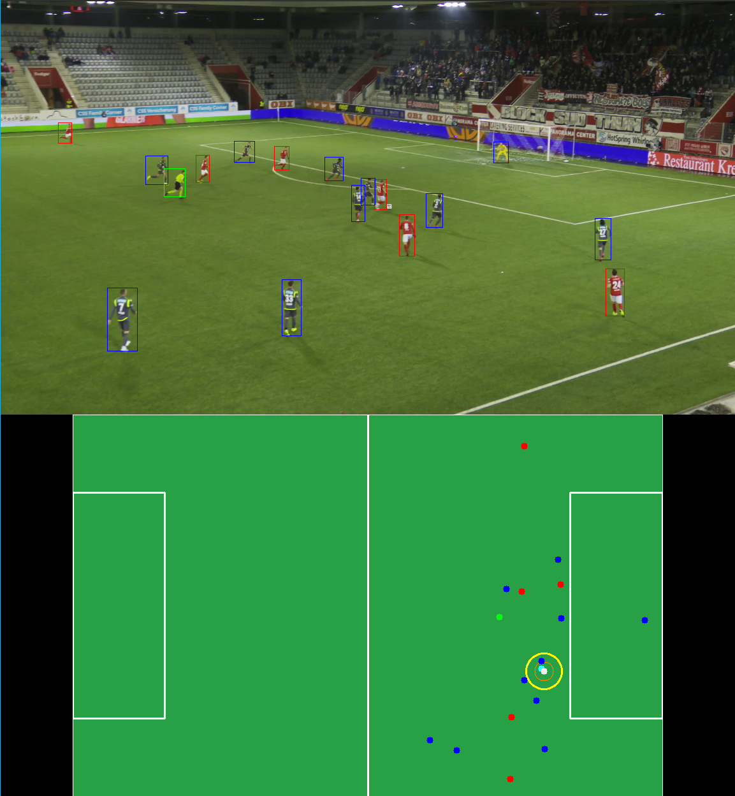

# Dribble and Tackle Detection Algorithm

A Rust-based implementation for detecting dribbling events on the [SoccerNet Game State Reconstruction 2024](https://www.soccer-net.org/) dataset. The goal behind this tool is not to get the most accurate predictions,but to get a set of good candidates which can be manually approved/rejected later.



## Visualization Controls

When visualizations are enabled and autoplay is disabled, you can manually control playback using the following keyboard commands:

- **Exit Program**: Press `q`
- **Skip to Next Video**: Press the `space` bar
- **Advance to Next Frame**: Press any other key

If review mode is on, these additional options are available:
- **Save as Dribble**: Press `d`
- **Save as Tackle**: Press `t`
- **Save as None**: Press `n`


## Dataset

* This tool is designed for data in the same format of the [Soccer net game state recognition challenge](https://github.com/SoccerNet/sn-gamestate/).
* An end-to-end pipeline which can easily preprocess and annotate a raw video file to the expected format can be found in the dribble detection pipeline [github](https://github.com/eirikeg1/dribbling-detection-algorithm). By disabling the last step of the pipeline in the config file, only the preprocessed dataset is saved.
* A simple way to download the data is through the official [Hugging Face dataset](https://huggingface.co/datasets/SoccerNet/SN-GSR-2025).
* The official challenge repository, with other instructions of how to download the data can be found at [sn-gamestate](https://github.com/SoccerNet/sn-gamestate)
* Refer to the official [SoccerNet website](https://www.soccer-net.org/) for more information about soccernet and their challenges/datasets

# Setup

## Configurations
Adjust paths, parallelism, and other runtime parameters in ```config.toml```.


This configuration file is divided into several sections. Here are the most important settings:

### General
- **num_cores**: Specifies how many CPU cores to use. It defaults to 1 if `video_mode` is set to "display".
- **log_level**: Sets the verbosity of log output. Options are "debug", "info", "warn", or "error".
- **video_mode**: Controls how video is handled:
  - `"download"`: Downloads video data.
  - `"display"`: Shows video output (may be slow over SSH).
  - `"none"`: Disables video processing.

### Dribbling Detection
- **outer_threshold**: Minimum number of frames needed for an event, reducing noise from brief fluctuations.
- **inner_threshold**: Time spent within a closer range that is not counted toward the outer threshold.
- **frame_skip**: Number of frames to skip during processing to improve performance.
- **min_duration**: Minimum action duration (in seconds) to qualify as dribbling.
- **inner_radius** and **outer_radius**: Define the detection zones (as a percentage of screen space) around the ball.
- **ignore_person_classes** and **ignore_teams**: Enable filtering to ignore specific person classifications or team-related information.

### Visualization
- **autoplay**: Toggles whether videos play automatically, or if to use keyboard commands
- **scale_factor**: Adjusts the size of the video and player bounding boxes (keep at 1 for downloading).
- **minimap_x**, **minimap_y**, **minimap_width**, **minimap_height**: Set the position and size of the minimap, ensuring a consistent aspect ratio. 
- **x_min**, **x_max**, **y_min**, **y_max**: Define the coordinate boundaries for visualizing the 2d minimap. If set wrong the points might be drawn either outside or too far inside the minimap.

### Data
- **data_path**: Path to the input data directory. *(For Docker, prefix paths with `./`.)*
- **subsets**: Specifies which data subsets to use (e.g., "interpolated-predictions").
- **output_path**: Directory where processed output will be stored.
- **huggingface_dataset_url**: URL to fetch a preview of the dataset from Hugging Face.

This setup allows you to adjust system resources, detection sensitivity, and visualization parameters to suit your project needs.


## Docker Setup

If you prefer to run the project inside a Docker container, you can use Docker Compose to encapsulate all dependencies and ensure a consistent environment.

### Overview

- **docker-compose.yaml**: Defines the `dribbling` service, mounting your project directory and mapping data paths.
- **Dockerfile**: Builds a slim Rust-based image with all required packages and dependencies.
- **update_env.sh**: Extracts `DATA_PATH` and `OUTPUT_PATH` from `config.toml` and writes them to a `.env` file.
- **entrypoint.sh**: Updates the environment and starts the dribbling detection algorithm.

### Prerequisites

- [Docker](https://docs.docker.com/get-docker/) installed
- [Docker Compose](https://docs.docker.com/compose/install/) installed

### Setup Instructions

1. **Environment Variables**  
   Ensure you define the following environment variables:
   - `DATA_PATH`: Path to the input data directory.
   - `OUTPUT_PATH`: Path to the output data directory.

   You can either create a `.env` file in the project root or export them in your shell.

2. **Build and Run the Container**  
   Use Docker Compose to build the image and run the container:
   ```bash
   docker-compose up --build


## Local Istallation
The installation steps is described for ubuntu based systems, but the steps are probably similar with different package managers.

### Requirements

- **Rust** (latest stable recommended)
- **OpenCV** (3.4 or 4.x)  
  Ensure OpenCV and its development headers are installed on your system. If automatic detection fails, the project’s `build.rs` ensures correct linking of OpenCV (including `stdc++`).
- **OpenSSL**
   Is a dependency of the reqwest library, used for downloading dataset

### Steps

1. **Install Rust**:  
   Follow the official [Rust installation guide](https://www.rust-lang.org/tools/install) to set up Rust and Cargo.

2. **Install OpenCV**:  
   Ensure OpenCV (3.4 or 4.x) is installed. For example, on Ubuntu/Debian:
   ```bash
   sudo apt-get update
   sudo apt-get install libopencv-dev pkg-config cmake
   ```
3. **Install openssl**
   * Debian and ubuntu:
   ```bash
   sudo apt-get install pkg-config libssl-dev
   ```
   * [Other](https://docs.rs/openssl/latest/openssl/)
4. **Clone the repository**
    ```bash
    git clone https://github.com/yourusername/dribbling-detection-algorithm.git
    cd dribbling-detection-algorithm
    ```
    At this point, the project should be ready to build and run.


## Building & Running
   To download data: (Not working yet, download as described above for now)
   ```bash
   cargo run -- --download
   ```


To run the algorithm:
```bash
cargo run
```

# Algorithm Description

This algorithm is designed to quickly identify clips that are more likely to contain dribbling actions from the 2025 SoccerNet Game-State Recognition Challenge dataset. It is not intended to be fully accurate but aims to facilitate efficient dataset creation, by outputting a large set of possible clips which quite likely might contain a dribble. It is based on the players 2d coordinate on the field (after a homographic transform).

It is a state space machine algorithm which does a single pass through the video.

---

## Conceptual Overview
1. **Possession Identification**
   - Tag the player closest to the ball as the possession holder.
   - Use proximity-based possession determination.
   - Consider integrating player velocity to improve possession tracking.
   - Adjust proximity range dynamically if many players are nearby.

2. **Proximity Zones**
   - **Outer Radius (outer_rad)**: Defines a larger interaction zone.
   - **Inner Radius (inner_rad)**: Defines a smaller, closer interaction zone.
   - This two-zone approach creates a "spatial interaction" framework for detecting events like tackles or dribbles.

3. **Event Detections**
   - **Dribble**: When the possession holder retains the ball after defensive pressure for a set period.
   - **Tackle**: When an opponent takes possession from the original possession holder.

---

## Algorithm Flow
**(Currently focused on dribbling detection, not tackling detection)**

1. **Initial Setup**
   - Define `outer_rad` (player radius) and `inner_rad` (ball radius). 
   - Consider homography to estimate distances.
   - Create a `DribbleEvent` structure to store:
     - Possession holder (player ID)
     - Start and end frames
     - List of frame numbers
     - List of active defenders (player IDs)

2. **State Transitions**
   - **Search State**: 
     1. Identify closest player to the ball.
     2. Check if the ball is within the player's `inner_rad`.
     3. Check for defenders within `inner_rad` or `outer_rad`.
     4. If defenders are found, transition to **Start Track State**.

   - **Start Track State**: 
     1. Record start frame.
     2. Add defenders within range to `active defenders`.
     3. Create a `DribbleEvent` and move to **Track State 1**.

   - **Track State 1 (Close Proximity to Defender)**: 
     1. Add the current frame to the dribble event's frame list.
     2. Add closest defender to active defenders.
     3. If possession changes or the ball is too far from the player, cancel the event and return to **Search State**.
     4. If any opponent enters `inner_rad`, transition to **Track State 2**.

   - **Track State 2 (Duel)**: 
     1. Freeze ball possession updates.
     2. Stay in this state until only one player remains within `inner_rad`.
     3. Transition to **Detection State**.

   - **Detection State**: 
     1. Identify possession holder.
     2. If original possession holder still has possession, start a timer or frame counter.
        - If possession is maintained for a set duration, a **Dribble** is detected.
     3. If an opponent listed as an active defender gains possession, a **Tackle** is detected.
     4. Save detections, if any, and return to **Search State**.

---

This logic aims to highlight potential dribbling clips, enabling faster dataset curation for training more robust dribbling detection models.

