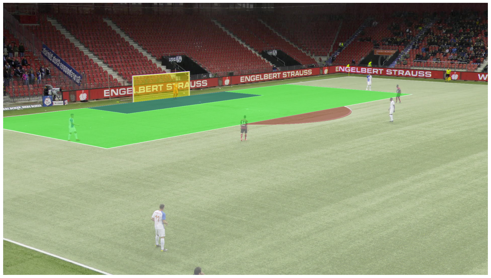
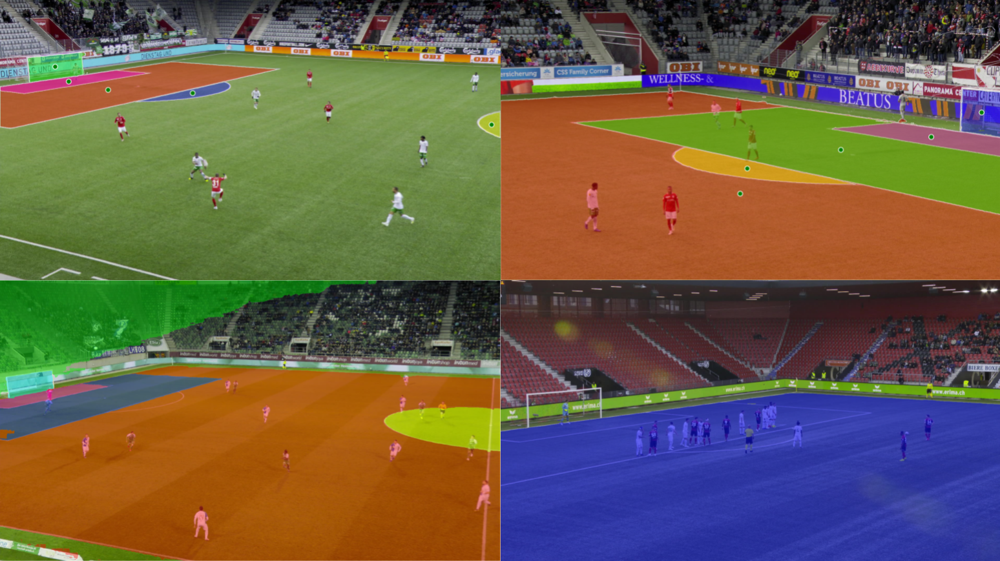

# Torkild Engen Finne - Sport Field Recognition in Soccer

## Abstract

Game state reconstruction is a key technology for player tracking, statistics, and highlight generation for sports events. A high standard in game state reconstruction makes it possible to run extensive sports analytics. However, game state recognition is a challenging task with several different components, including accurate and detailed recognition of the sports field. In this thesis, we focus on _sport field recognition_ as a bottleneck for accurate game state reconstruction in association with football (soccer). This work presents an exploratory approach to state-of-the-art and novel methods for automatically recognizing the soccer field in images and videos. Our main research involves the exploration of recent and generalized deep learning models for soccer field recognition with segmentation masks. We explore the potential of acknowledged models like _You Only Look Once (YOLO)_ and _Segment Anything (SAM)_. Our research presents methods to automatically predict different features on the soccer field. We demonstrate the potential of combining separate models to solve a task by improving the results. In general, our experiments discover both the potential of and several limitations associated with the methods in terms of segmentation mask prediction and classification.

## Repository

This repository provides code for sport field recognition using Segment Anything 2 (SAM2) and YOLO. It is built around the SoccerNet-GSR dataset which includes pitch-annotated video sequences of 30 seconds.

### Resources

- **Dataset:**
  - [SoccerNet-GSR](https://github.com/SoccerNet/sn-gamestate)
- **Models required:**
  - [Segment Anything 2 (SAM2)](https://github.com/facebookresearch/sam2)
  - [YOLO (Ultralytics)](https://github.com/ultralytics/ultralytics)

### Content

1. **Mask Generation from Labeled Points**  
   

   - Code for mask generation can be found in the [`mask_generation`](mask_generation/) folder. Generates a ground-truth segmentation mask of the field based on labeled points.

2. **Training, Evaluation, and Visualization**  
   
   - SAM2 and YOLO-based field segmentation and detection. Scripts to [`train`](training/) models, [`evaluate`](evaluation/) performance, and visualize predictions.
